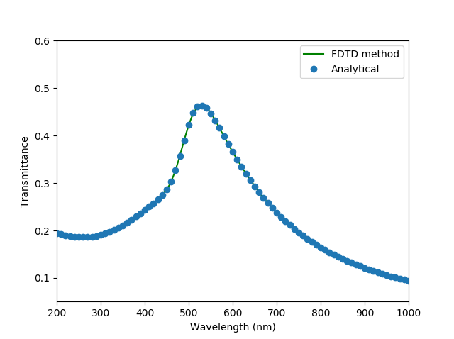

# Transmission through film of gold

An ADE-FDTD technique is presented for the modeling of metals using accurate dispersion functions first proposed in [1]. The numerical technique is clearly described in our papers [1,2]. 

Several years agor, various dispersion models have been proposed such as the Drude and the Drude-Lorentz with one or more poles to properly describe metals in the UV and optical range.

Recently, a new dispersive model has been proposed [1] that includes a single Drude term and *N* critical point pairs. It has been proved in several works that the Drude-critical point (DCP) model superpasses the classical models and it can very accurately describe the dielectric dispersion of metals in infrared and optical frequencies than the widely used Drude-Lorentz medium. 

In the code given here, we have validated our proposed method via the calculation of the transmittance through a 20-nm slab of gold. The gold is modelled as a Drude-critical point medium and the simulation is performed using the ADE-FDTD method proposed in [2,3]. It can be noted that very good agreement can be achieved.

In Julia REPL run 

    include("fdtd22_Drude_CP_slab_ADE.jl")
    include("fdtd22_air.jl")

Two files (total.txt and inc.txt) are saved on the disk. Then run the code
    
    include("Transmittance.jl")

to calculate the transmittance. A comparison between FDTD code and the analytical solution (using the Fourier transform and the expressions of analytical propagation models) is calculated and is given in the following figure.

  

**References**

[1] **A. Vial and T. Laroche**, “Description of dispersion of metals by means of the critical points model and applications to the study of resonant structures using FDTD method,” J. Phys. D:Appli. Phys., vol. 40, pp. 7152-7158, 2007. 

[2] **K. P. Prokopidis and D. C. Zografopoulos**, “A Unified FDTD/PML Scheme Based on Critical Points for Accurate Studies of Plasmonic Structures,” Journal of Lightwave Technology, vol. 31, pp. 2467-2476, Aug. 2013. [DOI: 10.1109/JLT.2013.2265166](http://dx.doi.org/10.1109/JLT.2013.2265166)

[3] **K. P. Prokopidis, D. C. Zografopoulos and E. E. Kriezis**,  “Rigorous broadband investigation of liquid-crystal plasmonic structures using finite-difference time-domain dispersive-anisotropic models,” J. Opt. Soc. Am. B,  Vol. 30, No. 10, pp 2722-2730,  October 2013. [DOI:10.1364/JOSAB.30.002722](http://dx.doi.org/10.1364/JOSAB.30.002722)

